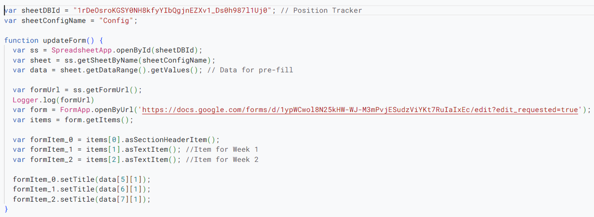

## Quick Get Started

- ***Update the links and sheet IDs***

## Introduction

This section provides details about the code used for automating the `Payroll Log Form`. It will be very detailed, and while knowledge about JavaScript is helpful, it's not required. The explanations focus on handling the closure/opening of the Google Form and editing the questions. For scripts related to the Approval Sheet, check [here](/non_paycom_doc/sheet_scripts).

## Accessing It

- ***You can find the code in the scripts of the form.***

- ***This is what you would see:***

## Code

- ***First 2 lines: These lines set up the name of the config sheet, which contains the dates and details about the current pay period. This is a sheet in the approval spreadsheet.***

- ***`updateForm` function: This function retrieves the current pay period details (PP number, start date, end date, etc.) from the config sheet and updates the form.***

- ***Sample Config Sheet:***

- ***`restrict` function: This function closes the submission form on the Saturday after the submission deadline and reopens it on the Saturday of the next week.***

## Triggers

These triggers define the schedule on which the functions run. Navigate to the triggers section on the left and add triggers using the blue button on the bottom right.

- ***Trigger for `restrict`: This function runs every week, alternating between closing the form one week and reopening it the next.***

- ***Trigger for `updateForm`: This function is intended to run every two weeks to update the form with each pay period. However, there is no biweekly trigger, and it does no harm to run it every week, so you can set it to run weekly like the `restrict` function.***

