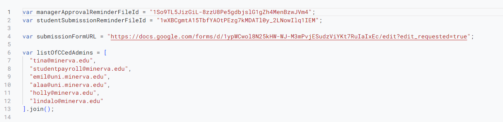
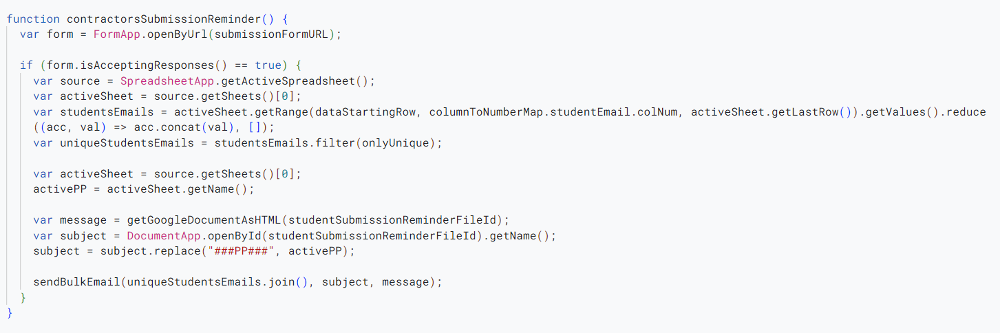

# Introduction

Here will be the details of the code being used. It will be very detailed. Knowledge about JavaScript will be valuable though not necessary. This page has the code for the automation of the `Approval Sheet`. The explanations are related to Handling Students submissions, managers approval, and maintaing the sheet of pay periods. For the scripts related to the google form, go [here](/non_paycom_doc/form_scripts)

# Accessing It

- ***You can find the code in the scripts of the form.***

- ***This is what you would see:***

# Code
## Email Reminders
- ***Definition of variables: defining the doc ids that have the format for the reminders to be sent to the students and managers. You might not need to update these ids but make sure to update the links in the documents.***
- [Manager reminder doc](https://docs.google.com/document/d/1So9TL5JizGiL-8zzU8Pe5gdbjslG1gZh4MenBzwJVm4/edit)
- [Student reminder doc](https://docs.google.com/document/d/1wXBCgmtA15TbfYAOtPEzg7kMDATl0y_2LNowIlq1IEM/edit)
- `listOfCCedAdmins` is a list of emails that will be cced in the reminder emails. 

- ***`onlyUnique`: This is a helper function for filtering unique values. We use it to prevent sending multiple reminders to the same manager who has multiple interns in the sheet.***

- ***`getGoogleDocumentAsHTML`: This is a helper function for getting the reminder content from the docs referenced above.***

- ***`sendBulkEmails`: A helper function for sending emails to multiple students or managers.***

- ***`managerApprovalReminder`: A helper function for sending emails to multiple students or managers.***

- ***`contractorsSubmissionReminder`: A helper function for sending emails to multiple students or managers.***

## Sheet
- ***Defining variables: The most important thing is to keep the position tracker url up to date.***

- ***`absoluteEditors`: These are the editors who will have edit access to previous pay periods' sheets. Changes are reflected in the future and are not retrospective.***

- ***`getSheetName`: Used to get the name of the sheet of the current pay period (the one just ending).***

- ***`getHardCopy`: Copying the actual values as a hard copy instead of copying sheets with formulas.***

- ***`putHardCopy`: Saving the copied sheet into a new sheet.***

- ***`sortByManagerName`: Sorting the sheet of the pay period by the managers names.***

- ***`copySheet`: This function runs every two weeks. It creates a copy of the pay period that ended and sends it to the end of the spreadsheet. It then creates the sheet of the current pay period.***

- ***`refillFormulas`: This function makes sure the formulas are filled out accurately in the pay period sheet in case something happened in the previos pay period.***

- ***`lockPPSheet`: As the name says. It looks the sheet of the pay period that ended so that no further edits happen.***

- ***`lockPPSheet`: As the name says. It looks the sheet of the pay period that ended so that no further edits happen.***

- ***`Some helper functions (getSumFormula, getTasksFormula, getHoursFormula)`:***

- ***`justificationValuesOnly`: This function helps convert the cells of the tasks completed by students to be plain text instead of formulas. This helps make those readable to managers when approving hours.***

# Triggers

These triggers define the schedule on which the functions run. Navigate to the triggers section on the left and add triggers using the blue button on the bottom right.

- ***Trigger for `copySheet`: This function runs every week. However, the function is defined to perform every two triggers so that the updating and copying happens every two weeks corresponding to a pay period.***

- ***Trigger for `contractorsSubmissionReminder`: This function runs every week and similar to the one above. It sends a reminder for students to submit hours.***

- ***Trigger for `managersApprovalReminder`: This function runs every week and similar to the ones above. It sends a reminder for managers to approve hours.***

- ***Trigger for `justificationValuesOnly`: This function runs slightly after copySheet function to make the tasks completed cells more readable.***

